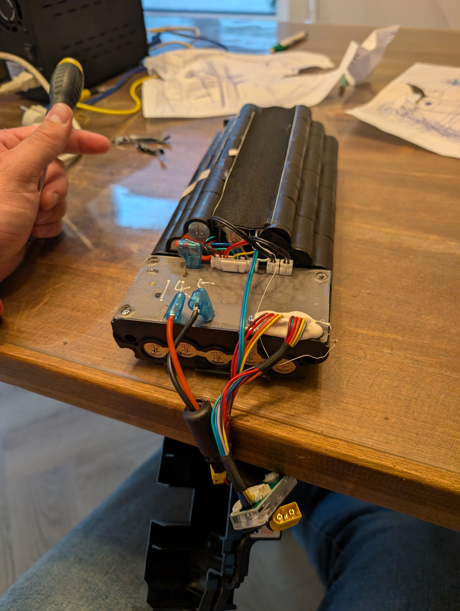
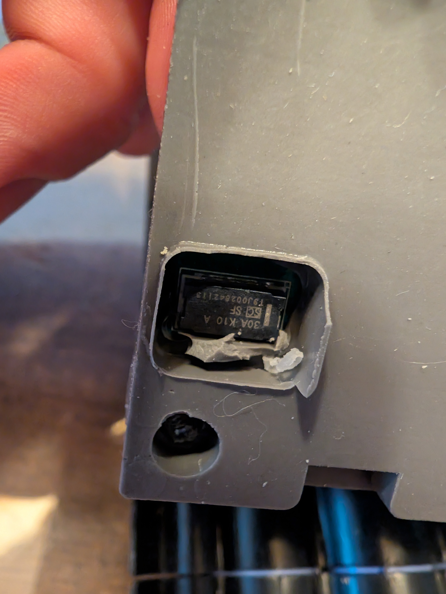
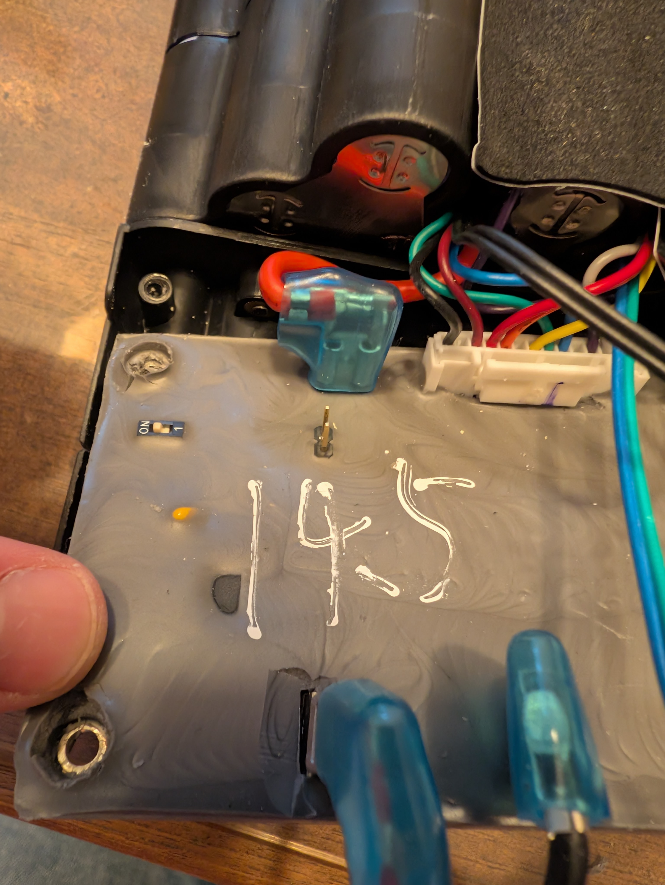
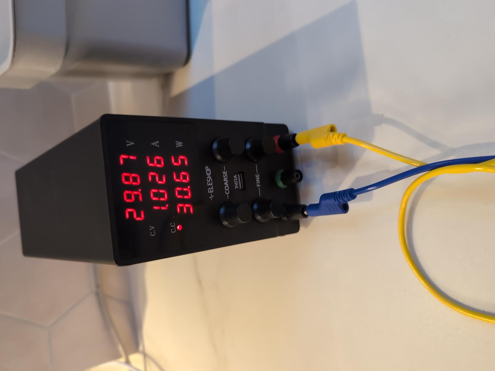
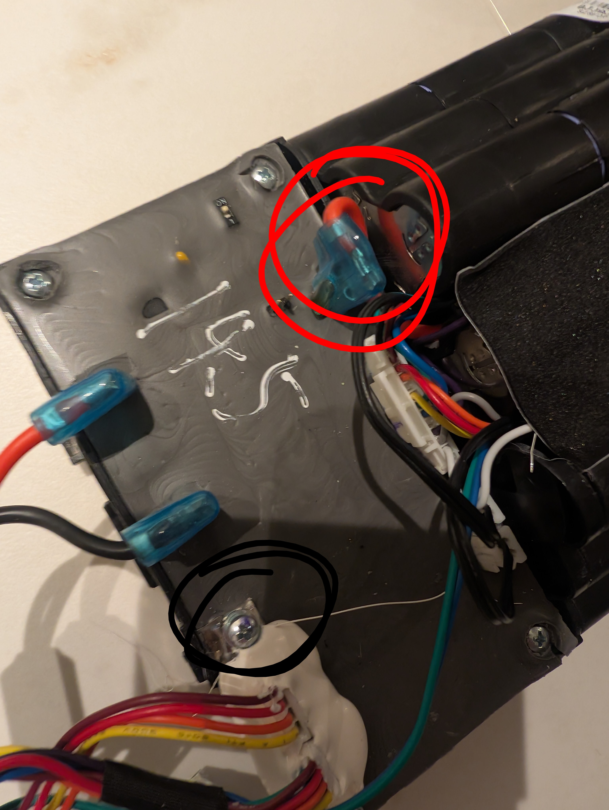
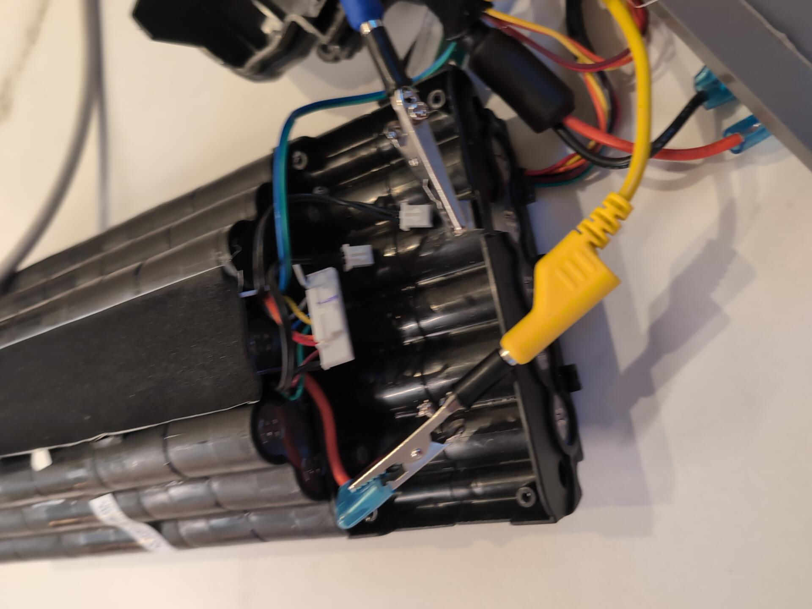

# Stella SF 2.0 battery recovery after deep discharge

A documented recovery of a Stella e-bike battery that had been stored for approximately four years and would no longer start charging normally.

> [!WARNING]
> **Lithium-ion battery work can cause fire, burns, electric shock, or cell failure.** This repository documents one successful repair case; it is **not** a universal charging recipe. Do not use the numerical settings here on a different battery without first establishing its chemistry, series configuration, cell-group voltages, and specified charging limits. Do not attempt this on a swollen, leaking, mechanically damaged, hot, or otherwise suspect pack.

## Result

In this case, the battery was successfully revived.

The cell stack was temporarily accessed upstream of the BMS and precharged with a **current-limited laboratory power supply**. The supply was configured with a **40 V voltage ceiling** and **1.5 A current limit**. The process was continuously supervised. When the pack reached approximately **38 V**, direct precharging was stopped, the BMS and connectors were reconnected, and the original charger was connected.

**The original charger then immediately began charging normally.**

This strongly suggests that the original failure was associated with the deeply discharged pack/BMS protection state. It does **not**, by itself, prove the exact internal BMS mechanism that prevented charging.

## Battery / BMS observations

During disassembly and investigation:

- The battery is a nominal 36 V-class lithium-ion e-bike battery.
- The BMS board marking observed during the investigation included **SH3676016BP**.
- Several low-voltage connections/pads were measured while investigating the electronics, including 5 V and ground.
- A microswitch is present in the assembly and appears related to the battery's on/off/control system.
- The normal charger initially alternated red/green and did not charge the deeply discharged battery.
- After controlled precharge and reassembly, normal charging resumed.

The precise purpose of every connector and test pad has **not** yet been established.

## Recovery sequence used in this case

### 1. Initial condition

The battery had been unused/in storage for roughly four years and would not charge normally with its original charger.

### 2. Open and inspect

The enclosure was opened and the battery pack, BMS, wiring, connectors and cells were visually inspected.

*Opened battery assembly. The cylindrical cell groups occupy the upper section; the potted BMS/electronics section and the high-current and multi-pin wiring are visible below. Photograph the original connector positions before disconnecting anything.*

Stop immediately if there is evidence of:

- swelling
- leakage
- corrosion severe enough to compromise connections
- damaged insulation
- melted wiring
- unusual smell
- mechanical cell damage
- unexpected heating

### 3. Isolate the cell stack from the BMS

For diagnosis, the cell stack was accessed on the **cell side of the BMS**.

*Close view of the BMS area. The heavy-gauge connections carry battery current, while the multi-pin connectors carry cell-sense/control wiring. The small ON switch and exposed auxiliary/test pin are visible. Their exact electrical functions should not be assumed from appearance alone.*

*Detail of the potted electronics. This image is useful for identifying the ON switch, the single exposed pin and connector locations. During the investigation some low-voltage points measured approximately 5 V, but this does not establish that the exposed connection is UART.*

This is a high-risk part of the work: an e-bike battery can deliver very high fault current. Insulated tools and protection against accidental shorts are essential.

### 4. Controlled precharge

A laboratory power supply with both voltage and current limiting was used.

*Bench supply during the recovery process. At the moment photographed it reads approximately **29.87 V, 1.026 A and 30.65 W** and is operating in constant-current (CC) mode. This is an intermediate measurement, **not** the final pack voltage and not a recommended setpoint for other batteries.*

*Temporary laboratory connections used to access the pack during the experiment. The photograph documents what was actually done; exposed alligator clips create a significant accidental-short risk. Insulated, mechanically secure and appropriately fused temporary connections are preferable for repeat testing.*

**Settings used in this specific battery recovery:**

| Parameter | Setting |
|---|---:|
| Supply voltage ceiling | 40 V |
| Current limit | 1.5 A |
| Precharge stop point | ~38 V pack voltage |
| Supervision | Continuous |

The pack voltage was monitored as it rose. The battery was watched for heating, swelling, odor, noise, or other abnormal behavior.

The 40 V / 1.5 A values are **observations from this repair, not generic safe values**.

### 5. Stop direct charging

At approximately 38 V pack voltage, the laboratory supply was disconnected.

*Connection-area reference photograph. The marked points helped distinguish the cell-stack side from the normal BMS-controlled external path. This photograph is included as a physical reference, not as a universal instruction to connect a supply to similarly positioned terminals on another battery.*

Direct cell-stack charging was **not** continued to full charge.

### 6. Reconnect the BMS

The battery connectors and BMS connections were restored to their normal configuration.

### 7. Test with the original charger

The original charger was connected while the battery remained accessible for observation.

The charger began charging normally.

This was the key confirmation that the battery/BMS had recovered sufficiently for the standard charging path to operate again.

## Important improvement for anyone reproducing the diagnosis

Before attempting precharge, **measure every series cell-group voltage individually** through the balance connections where this can be done safely.

Total pack voltage alone is not enough.

For example, two batteries can both measure 38 V while one has ten reasonably balanced groups and another contains one seriously undervoltage group compensated by higher-voltage groups. Those are very different conditions.

Record at minimum:

| Measurement | Record |
|---|---|
| Total cell-stack voltage | V |
| Lowest series-group voltage | V |
| Highest series-group voltage | V |
| Difference (max-min) | mV |
| Pack temperature before charging | °C |
| Supply current during recovery | A |
| Pack temperature during recovery | °C |

If one group is substantially different from the others, investigate the cells/group before proceeding.

## Safety principles learned

1. **Use a current-limited laboratory supply.** Never improvise with an uncontrolled power source.
2. **Establish the battery configuration and limits first.** Do not copy 40 V / 1.5 A onto an unknown pack.
3. **Measure individual series groups where possible.**
4. **Stay with the battery continuously.**
5. **Monitor temperature.**
6. Stop immediately for swelling, unexpected heating, smell, smoke, hissing, leakage or abnormal voltage behavior.
7. Keep the battery away from combustible material during diagnosis.
8. Prevent tools, probes and loose wires from shorting the cell stack.
9. Once the BMS accepts the normal charger again, use the intended charging system rather than continuing the bypass/precharge method.
10. A battery that can be made to charge is **not automatically a healthy battery**. Capacity, balance, internal resistance and behavior under load still matter.

## What is proven vs. inferred

### Observed

- The battery had been stored for a long period.
- The normal charger did not initially charge it.
- Controlled cell-stack precharge raised the pack voltage.
- Precharge was stopped at approximately 38 V.
- The BMS/connectors were reassembled.
- The original charger subsequently charged the battery normally.

### Likely / inferred

The low cell-stack voltage probably caused the BMS or charger/BMS combination to remain in a protection state in which normal charging would not initiate.

### Not yet proven

- The exact BMS protection state that was active.
- Whether the recovery threshold is exactly 38 V.
- Whether the BMS reset because of voltage, reconnection, charger insertion, or a combination of these.
- The precise function of all auxiliary pins/test pads.
- Long-term remaining battery capacity and state of health.

This distinction matters: **38 V should not be treated as a magic reset voltage.** It is simply the point at which we stopped precharging in this successful case.

## Recommended post-recovery checks

After the first normal charge:

- measure all series-group voltages again;
- check whether any group reaches the upper limit significantly earlier than the others;
- allow the pack to rest and check for abnormal self-discharge;
- test initially under a modest load;
- monitor temperature;
- estimate usable capacity during a controlled discharge;
- repeat the group-voltage measurement at a lower state of charge.

A weak parallel group may temporarily recover enough to operate but still have poor capacity or high internal resistance.

## Photos and further reverse engineering

The original repair photographs are stored under `images/` and are embedded at the relevant stages above.

Future work may include:

- annotated BMS photographs;
- connector pinout;
- identification of the microswitch circuit;
- investigation of the observed 5 V signals;
- determination of whether any auxiliary interface is UART, I²C/SMBus, debug, wake/control, or something else;
- cell-group voltage measurements;
- recovered capacity measurement.

## Why this repository exists

Long-stored e-bike batteries are often discarded when the standard charger refuses to start. Sometimes the underlying cells are irrecoverable and replacement is the correct outcome. In other cases, the battery may simply be below the normal BMS/charger operating window.

This project documents one real-world recovery so that other repairers have measurements and observations to start from rather than blindly experimenting.

## Contributing

If you have the same Stella battery/BMS, useful contributions include:

- clear PCB photographs;
- measured pinouts;
- individual cell-group measurements;
- BMS IC documentation;
- charger behavior;
- successful **and unsuccessful** recovery attempts;
- battery capacity measurements after recovery.

Please include the exact battery model and measurements. Do not generalize settings from a different battery chemistry or configuration.

## Disclaimer

This material is provided for documentation, research and repair education. Lithium-ion battery servicing involves significant hazards. Anyone working on a battery is responsible for verifying the battery configuration, electrical limits, condition and appropriate safety procedures for their specific pack.
